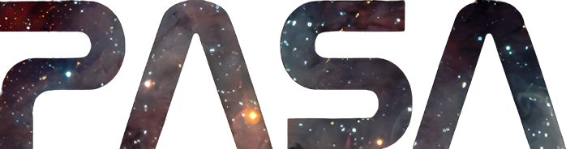

<h1 align="center">

</h1> 

Source code for the University of Calgary's Physics and Astronomy Student Association website. GitHub Pages is used as the hosting platform. Please submit an issue if any bugs are found.

View the website: [https://pasa.website](https://pasa.website)  
